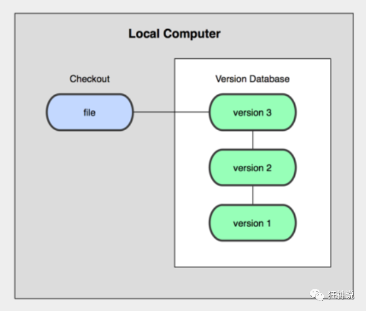

# 转载自“狂神聊Git”

## 什么是版本控制

版本控制（Revision control）是一种在开发的过程中用于管理我们对文件、目录或工程等内容的修改历史，方便查看更改历史记录，备份以便恢复以前的版本的软件工程技术。

- 实现跨区域多人协同开发
- 追踪和记载一个或者多个文件的历史记录
- 组织和保护你的源代码和文档
- 统计工作量
- 并行开发、提高开发效率
- 跟踪记录整个软件的开发过程
- 减轻开发人员的负担，节省时间，同时降低人为错误

简单说就是用于管理多人协同开发项目的技术。

没有进行版本控制或者版本控制本身缺乏正确的流程管理，在软件开发过程中将会引入很多问题，如软件代码的一致性、软件内容的冗余、软件过程的事物性、软件开发过程中的并发性、软件源代码的安全性，以及软件的整合等问题。

无论是工作还是学习，或者是自己做笔记，都经历过这样一个阶段！我们就迫切需要一个版本控制工具！


多人开发就必须要使用版本控制！

## 常见的版本控制工具

我们学习的东西，一定是当下最流行的！

主流的版本控制器有如下这些：

- **Git**
- **SVN**（Subversion）
- **CVS**（Concurrent Versions System）
- **VSS**（Micorosoft Visual SourceSafe）
- **TFS**（Team Foundation Server）
- Visual Studio Online

版本控制产品非常的多（Perforce、Rational ClearCase、RCS（GNU Revision Control System）、Serena Dimention、SVK、BitKeeper、Monotone、Bazaar、Mercurial、SourceGear Vault），现在影响力最大且使用最广泛的是Git与SVN

## 版本控制分类

**1、本地版本控制**

记录文件每次的更新，可以对每个版本做一个快照，或是记录补丁文件，适合个人用，如RCS。



**2、集中版本控制  SVN**

所有的版本数据都保存在服务器上，协同开发者从服务器上同步更新或上传自己的修改


所有的版本数据都存在服务器上，用户的本地只有自己以前所同步的版本，如果不连网的话，用户就看不到历史版本，也无法切换版本验证问题，或在不同分支工作。而且，所有数据都保存在单一的服务器上，有很大的风险这个服务器会损坏，这样就会丢失所有的数据，当然可以定期备份。代表产品：SVN、CVS、VSS

**3、分布式版本控制 	Git**

每个人都拥有全部的代码！安全隐患！

所有版本信息仓库全部同步到本地的每个用户，这样就可以在本地查看所有版本历史，可以离线在本地提交，只需在连网时push到相应的服务器或其他用户那里。由于每个用户那里保存的都是所有的版本数据，只要有一个用户的设备没有问题就可以恢复所有的数据，但这增加了本地存储空间的占用。

不会因为服务器损坏或者网络问题，造成不能工作的情况！


## Git与SVN的主要区别

SVN是集中式版本控制系统，版本库是集中放在中央服务器的，而工作的时候，用的都是自己的电脑，所以首先要从中央服务器得到最新的版本，然后工作，完成工作后，需要把自己做完的活推送到中央服务器。集中式版本控制系统是必须联网才能工作，对网络带宽要求较高。


Git是分布式版本控制系统，没有中央服务器，每个人的电脑就是一个完整的版本库，工作的时候不需要联网了，因为版本都在自己电脑上。协同的方法是这样的：比如说自己在电脑上改了文件A，其他人也在电脑上改了文件A，这时，你们两之间只需把各自的修改推送给对方，就可以互相看到对方的修改了。Git可以直接看到更新了哪些代码和文件！

**Git是目前世界上最先进的分布式版本控制系统。**

聊聊Git的历史

同生活中的许多伟大事物一样，Git 诞生于一个极富纷争大举创新的年代。

Linux 内核开源项目有着为数众广的参与者。绝大多数的 Linux 内核维护工作都花在了提交补丁和保存归档的繁琐事务上(1991－2002年间)。到 2002 年，整个项目组开始启用一个专有的分布式版本控制系统 BitKeeper 来管理和维护代码。

Linux社区中存在很多的大佬！破解研究 BitKeeper ！

到了 2005 年，开发 BitKeeper 的商业公司同 Linux 内核开源社区的合作关系结束，他们收回了 Linux 内核社区免费使用 BitKeeper 的权力。这就迫使 Linux 开源社区(特别是 Linux 的缔造者 Linus Torvalds)基于使用 BitKeeper 时的经验教训，开发出自己的版本系统。（2周左右！） 也就是后来的 Git！

**Git是目前世界上最先进的分布式版本控制系统。**

Git是免费、开源的，最初Git是为辅助 Linux 内核开发的，来替代 BitKeeper！


Linux和Git之父李纳斯·托沃兹（Linus Benedic Torvalds）1969、芬兰

## 初识Git

### 软件下载

打开 [git官网](https://git-scm.com/)，下载git对应操作系统的版本。

所有东西下载慢的话就可以去找镜像！

官网下载太慢，我们可以使用淘宝镜像下载：http://npm.taobao.org/mirrors/git-for-windows/


下载对应的版本即可安装！

安装：无脑下一步即可！安装完毕就可以使用了！

### 启动Git

安装成功后在开始菜单中会有Git项，菜单下有3个程序：任意文件夹下右键也可以看到对应的程序！


**Git Bash：**Unix与Linux风格的命令行，使用最多，推荐最多

**Git CMD：**Windows风格的命令行

**Git GUI**：图形界面的Git，不建议初学者使用，尽量先熟悉常用命令

## 常用的Linux命令

平时一定要多使用这些基础的命令！

1. cd : 改变目录。

2. `cd ..` :回退到上一个目录，直接cd进入默认目录(cd和点点之前有一个空格)

3. pwd : 显示当前所在的目录路径。

4. ls(ll):  都是列出当前目录中的所有文件，只不过ll(两个ll)列出的内容更为详细。

5. touch : 新建一个文件 如 touch index.js 就会在当前目录下新建一个index.js文件。

6. rm:  删除一个文件, rm index.js 就会把index.js文件删除。

7. mkdir:  新建一个目录,就是新建一个文件夹。

8. rm -r :  删除一个文件夹, rm -r src 删除src目录

```
rm -rf / 切勿在Linux中尝试！删除电脑中全部文件！
```

9. mv 移动文件, `mv index.html src` index.html 是我们要移动的文件, src 是目标文件夹,当然, 这样写,必须保证文件和目标文件夹在同一目录下。

10. reset 重新初始化终端/清屏。

11. clear 清屏。

12. history 查看命令历史。

13. help 帮助。

14. exit 退出。

15. #表示注释

## Git配置

所有的配置文件，其实都保存在本地！

查看配置 git config -l


查看不同级别的配置文件：

```
# 查看系统config
git config --system --list　　
# 查看当前用户（global）配置
git config --global  --list
```

**Git相关的配置文件：**

1. Git\etc\gitconfig  ：Git 安装目录下的 gitconfig   --system 系统级

2. C:\Users\Administrator\ .gitconfig   只适用于当前登录用户的配置  --global 全局


这里可以直接编辑配置文件，通过命令设置后会响应到这里。

## 设置用户名与邮箱（用户标识，必要）

当你安装Git后首先要做的事情是设置你的用户名称和e-mail地址。这是非常重要的，因为每次Git提交都会使用该信息。它被永远的嵌入到了你的提交中：

```
git config --global user.name "kuangshen"  #名称
git config --global user.email 24736743@qq.com   #邮箱
```

只需要做一次这个设置，如果你传递了--global 选项，因为Git将总是会使用该信息来处理你在系统中所做的一切操作。如果你希望在一个特定的项目中使用不同的名称或e-mail地址，你可以在该项目中运行该命令而不要--global选项。总之--global为全局配置，不加为某个项目的特定配置。


Git基本理论（重要）

## 三个区域

Git本地有三个工作区域：工作目录（Working Directory）、暂存区(Stage/Index)、资源库(Repository或Git Directory)。如果在加上远程的git仓库(Remote Directory)就可以分为四个工作区域。文件在这四个区域之间的转换关系如下：


- Workspace：工作区，就是你平时存放项目代码的地方
- Index / Stage：暂存区，用于临时存放你的改动，事实上它只是一个文件，保存即将提交到文件列表信息
- Repository：仓库区（或本地仓库），就是安全存放数据的位置，这里面有你提交到所有版本的数据。其中HEAD指向最新放入仓库的版本
- Remote：远程仓库，托管代码的服务器，可以简单的认为是你项目组中的一台电脑用于远程数据交换

本地的三个区域确切的说应该是git仓库中HEAD指向的版本：


- Directory：使用Git管理的一个目录，也就是一个仓库，包含我们的工作空间和Git的管理空间。
- WorkSpace：需要通过Git进行版本控制的目录和文件，这些目录和文件组成了工作空间。
- .git：存放Git管理信息的目录，初始化仓库的时候自动创建。
- Index/Stage：暂存区，或者叫待提交更新区，在提交进入repo之前，我们可以把所有的更新放在暂存区。
- Local Repo：本地仓库，一个存放在本地的版本库；HEAD会只是当前的开发分支（branch）。
- Stash：隐藏，是一个工作状态保存栈，用于保存/恢复WorkSpace中的临时状态。

## 工作流程

git的工作流程一般是这样的：

１、在工作目录中添加、修改文件；

２、将需要进行版本管理的文件放入暂存区域；

３、将暂存区域的文件提交到git仓库。

因此，git管理的文件有三种状态：已修改（modified）,已暂存（staged）,已提交(committed)


## Git项目搭建

### 工作目录与常用指令

工作目录（WorkSpace)一般就是你希望Git帮助你管理的文件夹，可以是你项目的目录，也可以是一个空目录，建议不要有中文。

日常使用只要记住下图6个命令：


### 本地仓库搭建

创建本地仓库的方法有两种：一种是创建全新的仓库，另一种是克隆远程仓库。

1. 创建全新的仓库，需要用GIT管理的项目的根目录执行：

```
# 在当前目录新建一个Git代码库
$ git init
```

执行后可以看到，**在项目目录多出了一个.git目录**，关于版本等的所有信息都在这个目录里面。

2. 克隆远程仓库

另一种方式是克隆远程目录，由于是将远程服务器上的仓库完全镜像一份至本地！

```
# 克隆一个项目和它的整个代码历史(版本信息)
$ git clone [url]  # https://gitee.com/kuangstudy/openclass.git
```

## Git文件操作

### 文件的四种状态

版本控制就是对文件的版本控制，要对文件进行修改、提交等操作，首先要知道文件当前在什么状态，不然可能会提交了现在还不想提交的文件，或者要提交的文件没提交上。

- Untracked: 未跟踪, 此文件在文件夹中, 但并没有加入到git库, 不参与版本控制. 通过git add 状态变为Staged.
- Unmodify: 文件已经入库, 未修改, 即版本库中的文件快照内容与文件夹中完全一致. 这种类型的文件有两种去处, 如果它被修改, 而变为Modified. 如果使用git rm移出版本库, 则成为Untracked文件
- Modified: 文件已修改, 仅仅是修改, 并没有进行其他的操作. 这个文件也有两个去处, 通过git add可进入暂存staged状态, 使用git checkout 则丢弃修改过, 返回到unmodify状态, 这个git checkout即从库中取出文件, 覆盖当前修改 !
- Staged: 暂存状态. 执行git commit则将修改同步到库中, 这时库中的文件和本地文件又变为一致, 文件为Unmodify状态. 执行git reset HEAD filename取消暂存, 文件状态为Modified

### 查看文件状态

上面说文件有4种状态，通过如下命令可以查看到文件的状态：

```
#查看指定文件状态
git status [filename]
#查看所有文件状态
git status
# git add .                  添加所有文件到暂存区
# git commit -m "消息内容"    提交暂存区中的内容到本地仓库 -m 提交信息
```

### 忽略文件

有些时候我们不想把某些文件纳入版本控制中，比如数据库文件，临时文件，设计文件等

在主目录下建立".gitignore"文件，此文件有如下规则：

1. 忽略文件中的空行或以井号（#）开始的行将会被忽略。
2. 可以使用Linux通配符。例如：星号（*）代表任意多个字符，问号（？）代表一个字符，方括号（[abc]）代表可选字符范围，大括号（{string1,string2,...}）代表可选的字符串等。
3. 如果名称的最前面有一个感叹号（!），表示例外规则，将不被忽略。
4. 如果名称的最前面是一个路径分隔符（/），表示要忽略的文件在此目录下，而子目录中的文件不忽略。
5. 如果名称的最后面是一个路径分隔符（/），表示要忽略的是此目录下该名称的子目录，而非文件（默认文件或目录都忽略）。

```
#为注释
*.txt        #忽略所有 .txt结尾的文件,这样的话上传就不会被选中！
!lib.txt     #但lib.txt除外
/temp        #仅忽略项目根目录下的TODO文件,不包括其它目录temp
build/       #忽略build/目录下的所有文件
doc/*.txt    #会忽略 doc/notes.txt 但不包括 doc/server/arch.txt
```

## 使用码云

github 是有墙的，比较慢，在国内的话，我们一般使用 gitee ，公司中有时候会搭建自己的gitlab服务器

这个其实可以作为大家未来找工作的一个重要信息！

1、注册登录码云，完善个人信息


2、设置本机绑定SSH公钥，实现免密码登录！（免密码登录，这一步挺重要的，码云是远程仓库，我们是平时工作在本地仓库！)

```
# 进入 C:\Users\Administrator\.ssh 目录
# 生成公钥
ssh-keygen
```


3、将公钥信息public key 添加到码云账户中即可！


4、使用码云创建一个自己的仓库！


许可证：开源是否可以随意转载，开源但是不能商业使用，不能转载，...  限制！


克隆到本地！


## IDEA中集成Git

1、新建项目，绑定git。


注意观察idea中的变化


2、修改文件，使用IDEA操作git。

- 添加到暂存区
- commit 提交
- push到远程仓库

3、提交测试


这些都是单个人的操作！

学习的方式最重要！学会学习！我上课的更多时候都是在教大家去学习一种理念和思想（学习方式）

有道无术、术尚可求。有术无道、止于术！

真正的教学，授人以渔！

## GIt在PyCharm的使用教程

### 在pycharm中配置git

**点击file--->settings**,然后出图所示：


### 创建仓库

**在pycharm的terminal中输入。**

方法一：手动创建目录名 + git init

方法二：git init 目录名

方法三：拷贝一个库，打开GitHub，找到需要的库，点击**clone or download**，复制链接。在pycharm中输入 **git clone + 复制连接 + 目录名**，即可创建库。


### 一些基础操作

**1.git status** 查看库的状态


2.创建一个文件后，再次查看。


3.保存一条记录：**git add \*(全局)/ git add file,txt(保存文件到暂存区)**

​             **git commit -m "备注"**


4.检查保存记录：**git log**


**注意：出现乱码，如下图操作**


5.修改文件内容，再次保存，查看。

**注意：内容未显示完整，jk可以上下移动；**

​     **按q是退出。**


6.返回之前保存的记录：**git checkout +序列号**

  返回上一个记录**：git checkout -**

  查看具体操作内容：**git log -p**


7.添加标签（默认在最近，添加tag）：**git tag -a 标签名 -m "备注"**

  在指定内容后添加标签**：git tag -a 标签名 -m "备注" 序列号**

  查看标签：**git show 标签名**

  返回之前的版本：**git checkout 标签名**

  标记把每一个提交压缩到了一行中**：git log --oneline**

  每次提交全部显示出来**：git log --oneline --all**

  建立分支：**git branch 分支名**

  切换到某分支：**git checkout 分支名**

  回到默认默认的分支：**git checkout master**

  图示全部历史记录：**git log --graph --all --oneline**

  合并分支：**git merge 分支名**

### 建立远程仓库提交代码  

1,在pycharm中登录GitHub


2.Git SSH 创建Key的步骤：

a.桌面右键打开Git Bash Here

b.依次输入：cd ~/.ssh/ （若出现“No such file or directory”,则表示需要创建一个ssh keys）

​         git config --global user.name "起个名字"

​         git config --global user.email "你的邮箱"

​         ssh-keygen -t rsa -C "你的邮箱" 三个连续回车，设置密码为空

​         **注意：ssh-keygen之间没有空格**

 

c.在C盘中找到.ssh,路径如下图，得到id_rsa和id_rsa.pub，用记事本打开id_rsa.pub，复制里面的内容。

**注意：里面要是有known_hosts先删掉**


4.打开GitHub：[https://gruxiatiithub.com](https://github.com/) 


然后把之前复制的id_rsa.pub，粘贴进去。

5.检查是否添加成功：github输入命令：ssh git@github.com

注意：“Hi 你的名称! You've successfully authenticated, but GitHub does not provide shel l access.”说明添加成功

6.如图所示：


**恭喜你成功了！！！！！**

7.最后还有git更新库，克隆库的操作


 

## 说明：GIT分支

分支在GIT中相对较难，分支就是科幻电影里面的平行宇宙，如果两个平行宇宙互不干扰，那对现在的你也没啥影响。不过，在某个时间点，两个平行宇宙合并了，我们就需要处理一些问题了！


git分支中常用指令：

```python
#  -M 参数是用来给分支改名的 ，它将分支重命名为main (因为使用命令行创建的存储库的默认分支名称是master)
git branch -M main 的作用
# 列出所有本地分支
git branch

# 列出所有远程分支
git branch -r

# 新建一个分支，但依然停留在当前分支
git branch [branch-name]

# 新建一个分支，并切换到该分支
git checkout -b [branch]

# 合并指定分支到当前分支
$ git merge [branch]

# 删除分支
$ git branch -d [branch-name]

# 删除远程分支
$ git push origin --delete [branch-name]
$ git branch -dr [remote/branch]
```

如果同一个文件在合并分支时都被修改了则会引起冲突：解决的办法是我们可以修改冲突文件后重新提交！选择要保留他的代码还是你的代码！

master主分支应该非常稳定，用来发布新版本，一般情况下不允许在上面工作，工作一般情况下在新建的dev分支上工作，工作完后，比如上要发布，或者说dev分支代码稳定后可以合并到主分支master上来。

# Git常用命令

==首先最重要的一点是:==

​	==输入命令时, 可以使用Tab键补全!==

## 配置

```
# 显示当前的Git配置
$ git config --list

# 编辑Git配置文件
$ git config -e [--global]
git config --global user.name "guoyongjian"
git config --global user.email "1432231619@qq.com"
# 设置提交代码时的用户信息
$ git config --global user.name "[name]"
$ git config --global user.email "[email address]"
```

## 仓库

在当前目录新建一个Git代码库

```
$ git init
```

瞬间Git就把仓库建好了，而且告诉你是一个空的仓库（empty Git repository），细心的读者可以发现当前目录下多了一个.git的目录，这个目录是Git来跟踪管理版本库的，没事千万不要手动修改这个目录里面的文件，不然改乱了，就把Git仓库给破坏了。

如果你没有看到.git目录，那是因为这个目录默认是隐藏的，用ls -ah命令就可以看见。

新建一个目录，将其初始化为Git代码库

```
$ git init [project-name]
```

下载一个项目和它的整个代码历史

```
$ git clone [url]
```

## 增加/删除文件

**停止追踪指定文件，但该文件会保留在工作区**

$ git rm --cached [file]

```
# 添加指定文件到暂存区
$ git add [file1] [file2] ...

# 添加指定目录到暂存区，包括子目录
$ git add [dir]

# 添加当前目录的所有文件到暂存区
$ git add .

# 添加每个变化前，都会要求确认
# 对于同一个文件的多处变化，可以实现分次提交
$ git add -p

# 删除工作区文件，并且将这次删除放入暂存区
$ git rm [file1] [file2] ...

# 改名文件，并且将这个改名放入暂存区
$ git mv [file-original] [file-renamed]
```

## 代码提交

```
# 提交暂存区到仓库区
$ git commit -m [message]

# 提交暂存区的指定文件到仓库区
$ git commit [file1] [file2] ... -m [message]

# 提交工作区自上次commit之后的变化，直接到仓库区
$ git commit -a

# 提交时显示所有diff信息
$ git commit -v

# 使用一次新的commit，替代上一次提交
# 如果代码没有任何新变化，则用来改写上一次commit的提交信息
$ git commit --amend -m [message]

# 重做上一次commit，并包括指定文件的新变化
$ git commit --amend [file1] [file2] ...
```

为什么Git添加文件需要`add`，`commit`一共两步呢？因为`commit`可以一次提交很多文件，所以你可以多次`add`不同的文件，比如：

```
$ git add file1.txt
$ git add file2.txt file3.txt
$ git commit -m "add 3 files."
```

## 查看信息

**显示有变更的文件**

`$ git status`

**显示暂存区和工作区的差异**

`$ git diff`

**显示当前分支的版本历史**

`$ git log`

显示当前分支的历史版本 (精简版)

`$ git reflog`

在屏幕上显示出文件的内容

`$ cat readme.txt`

小结

- 要随时掌握工作区的状态，使用`git status`命令。
- 如果`git status`告诉你有文件被修改过，用`git diff`可以查看修改内容。

```
# 显示commit历史，以及每次commit发生变更的文件
$ git log --stat

# 搜索提交历史，根据关键词
$ git log -S [keyword]

# 显示某个commit之后的所有变动，每个commit占据一行
$ git log [tag] HEAD --pretty=format:%s

# 显示某个commit之后的所有变动，其"提交说明"必须符合搜索条件
$ git log [tag] HEAD --grep feature

# 显示某个文件的版本历史，包括文件改名
$ git log --follow [file]
$ git whatchanged [file]

# 显示指定文件相关的每一次diff
$ git log -p [file]

# 显示过去5次提交
$ git log -5 --pretty --oneline

# 显示所有提交过的用户，按提交次数排序
$ git shortlog -sn

# 显示指定文件是什么人在什么时间修改过
$ git blame [file]

# 显示暂存区和上一个commit的差异
$ git diff --cached [file]

# 显示工作区与当前分支最新commit之间的差异
$ git diff HEAD

# 显示两次提交之间的差异
$ git diff [first-branch]...[second-branch]

# 显示今天你写了多少行代码
$ git diff --shortstat "@{0 day ago}"

# 显示某次提交的元数据和内容变化
$ git show [commit]

# 显示某次提交发生变化的文件
$ git show --name-only [commit]

# 显示某次提交时，某个文件的内容
$ git show [commit]:[filename]
```

## 版本穿梭

1. 首先使用`git reflog` 或者 `git log` 显示当前分支的历史版本, 以便确定要回退到哪个版本。

2. `HEAD`指向的版本就是当前版本，因此，Git允许我们在版本的历史之间穿梭，使用命令`git reset --hard [commit_id]`。

## 分支

### 列出分支

```
# 列出所有本地分支
$ git branch

# 列出所有远程分支
$ git branch -r

# 列出所有本地分支和远程分支
$ git branch -a
```

### 新建分支

```
# 新建一个分支，但依然停留在当前分支
$ git branch [branch-name]

# 新建一个分支，并切换到该分支
$ git checkout -b [branch]

# 新建一个分支，指向指定commit
$ git branch [branch] [commit]

# 新建一个分支，与指定的远程分支建立追踪关系
$ git branch --track [branch] [remote-branch]
```

### 分支的切换修改与删除

```
#  -M 参数是用来给分支改名的,它将分支重命名为main (因为使用命令行创建的存储库的默认分支名称是master), 从 2020 年 10 月 1 日开始，GitHub 上的所有新库都将用中性词「main」命名，取代原来的「master」，因为后者是一个容易让人联想到奴隶制的术语。
git branch -M main  

# 切换到指定分支，并更新工作区
$ git checkout [branch-name]

# 切换到上一个分支
$ git checkout -

# 建立追踪关系，在现有分支与指定的远程分支之间
$ git branch --set-upstream [branch] [remote-branch]

# 选择一个commit，合并进当前分支
$ git cherry-pick [commit]

# 删除分支
$ git branch -d [branch-name]

# 删除远程分支
$ git push origin --delete [branch-name]
$ git branch -dr [remote/branch]
```

### 合并分支

#### 正常合并

```
# 合并指定分支到当前分支
$ git merge [branch]
```

#### 异常合并

合并分支时，两个分支在同一个文件的同一个位置 有两套完全不同的修改。 Git无法替我们决定使用哪一个。必须人为决定新代码内容，然后进行 `git add` , `git commit` 等操作。

## 标签

```
# 列出所有tag
$ git tag

# 新建一个tag在当前commit
$ git tag [tag]

# 新建一个tag在指定commit
$ git tag [tag] [commit]

# 删除本地tag
$ git tag -d [tag]

# 删除远程tag
$ git push origin :refs/tags/[tagName]

# 查看tag信息
$ git show [tag]

# 提交指定tag
$ git push [remote] [tag]

# 提交所有tag
$ git push [remote] --tags

# 新建一个分支，指向某个tag
$ git checkout -b [branch] [tag]
```

## 远程同步

```
# 下载远程仓库的所有变动
$ git fetch [remote]

# 显示所有远程仓库
$ git remote -v

# 显示某个远程仓库的信息
$ git remote show [remote]

# 链接一个新的远程仓库，并取一个简短的名字
$ git remote add [shortname] [url]
# 一般远程仓库的名字被命名为origin 

# 取回远程仓库的变化，并与本地分支合并
$ git pull [remote] [branch]

# 上传本地指定分支到远程仓库
$ git push [remote] [branch]

# 强行推送当前分支到远程仓库，即使有冲突
$ git push [remote] --force

# 推送所有分支到远程仓库
$ git push [remote] --all
```

## 撤销

```
# 恢复暂存区的指定文件到工作区
$ git checkout [file]

# 恢复某个commit的指定文件到暂存区和工作区
$ git checkout [commit] [file]

# 恢复暂存区的所有文件到工作区
$ git checkout .

# 重置暂存区的指定文件，与上一次commit保持一致，但工作区不变
$ git reset [file]

# 重置暂存区与工作区，与上一次commit保持一致
$ git reset --hard

# 重置当前分支的指针为指定commit，同时重置暂存区，但工作区不变
$ git reset [commit]

# 重置当前分支的HEAD为指定commit，同时重置暂存区和工作区，与指定commit一致
$ git reset --hard [commit]

# 重置当前HEAD为指定commit，但保持暂存区和工作区不变
$ git reset --keep [commit]

# 新建一个commit，用来撤销指定commit
# 后者的所有变化都将被前者抵消，并且应用到当前分支
$ git revert [commit]

暂时将未提交的变化移除，稍后再移入
$ git stash
$ git stash pop
```

## 其他

```
# 生成一个可供发布的压缩包
$ git archive
```

# GitHub配置SSH Key

```
https://github.com/xiangshuo1992/preload.git
git@github.com:xiangshuo1992/preload.git
```

这两个地址展示的是同一个项目，但是这两个地址之间有什么联系呢？
前者是https url 直接有效网址打开，但是用户每次通过git提交的时候都要输入用户名和密码，有没有简单的一点的办法，一次配置，永久使用呢？当然，所以有了第二种地址，也就是SSH URL，那如何配置就是本文要分享的内容。
GitHub配置SSH Key的目的是为了帮助我们在通过git提交代码是，不需要繁琐的验证过程，简化操作流程。

## 检查是否存在SSH Key

```
cd ~/.ssh
ls
或者
ll
//看是否存在 id_rsa 和 id_rsa.pub文件，如果存在，说明已经有SSH Key
```


如果没有SSH Key，则需要先生成一下

```
ssh-keygen -t rsa -C "[邮箱]"
```

执行之后继续执行以下命令来获取SSH Key

```
cd ~/.ssh
ls
或者
ll
//看是否存在 id_rsa 和 id_rsa.pub文件，如果存在，说明已经有SSH Key
1
```

## 获取SSH Key

```
cat id_rsa.pub
//拷贝秘钥 ssh-rsa开头
```


## GitHub添加SSH Key

GitHub点击用户头像，选择setting


新建一个SSH Key


取个名字，把之前拷贝的秘钥复制进去，添加就好啦。

## 验证和修改

测试是否成功配置SSH Key

```
ssh -T git@github.com
//运行结果出现类似如下
Hi xiangshuo1992! You've successfully authenticated, but GitHub does not provide shell access.
```


